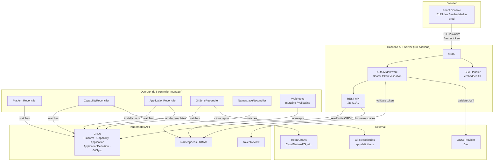

# kr8

kr8 is a Kubernetes platform operator that manages capabilities (databases, etc.), application deployments, and provides a web console — all driven by custom resources.

## Architecture



### Components

| Component | Image | Description |
|-----------|-------|-------------|
| **Operator** | `ghcr.io/ykube-app/kr8-operator` | Controller-runtime operator. Reconciles Platform, Capability, Application, ApplicationDefinition, GitSync CRDs. Provisions Helm charts and renders app templates. |
| **Backend + Console** | `ghcr.io/ykube-app/kr8-backend` | Go HTTP server that proxies Kubernetes API calls and serves the embedded React console. Validates Bearer tokens via K8s TokenReview or OIDC JWT. |

### CRDs

| Kind | Scope | Purpose |
|------|-------|---------|
| **Platform** | Cluster | Root object — one per cluster. Owns capability list and optional console deployment. |
| **Capability** | Namespaced | A provisioned cluster service (e.g. Postgres). Reconciled to a Helm release. |
| **Application** | Namespaced | A user workload. Rendered from an ApplicationDefinition template; gets secrets injected. |
| **ApplicationDefinition** | Namespaced | Go-template based app blueprint with parameter schema. |
| **GitSync** | Namespaced | Clones an app definition repository and keeps ApplicationDefinitions in sync. |

### API Routes

| Method | Path | Description |
|--------|------|-------------|
| `GET/POST` | `/api/v1/platform/{name}` | Platform CR |
| `GET/POST` | `/api/v1/capabilities` | Capability CRs |
| `GET/POST/DELETE` | `/api/v1/applications` | Application CRs; filter by `?namespace=` |
| `GET` | `/api/v1/catalog` | ApplicationDefinitions available via GitSync |
| `GET/POST` | `/api/v1/projects` | Namespace management (RBAC-aware) |
| `GET` | `/api/v1/users` | Cluster users |
| `GET/POST` | `/api/auth/login` · `/api/auth/callback` · `/api/auth/password` | OAuth / password auth |

---

## Quick Install

Apply the latest release manifest — no source required:

```sh
kubectl apply -f https://github.com/ykube-app/kr8/releases/latest/download/install.yaml
```

For a specific version:

```sh
kubectl apply -f https://github.com/ykube-app/kr8/releases/download/v0.0.11/install.yaml
```

This installs the CRDs and deploys the operator in the `kr8-system` namespace.

---

## Verify the operator is running

```sh
kubectl get pods -n kr8-system
kubectl logs -n kr8-system -l control-plane=controller-manager -f
```

---

## Create a Platform

The `Platform` CR is the root object — create one per cluster:

```sh
kubectl apply -f - <<EOF
apiVersion: kr8.ykube.app/v1alpha1
kind: Platform
metadata:
  name: cluster
spec: {}
EOF
```

```sh
kubectl get platform
```

---

## Deploy the kr8 Console

The console and backend ship as a single combined image. To have the operator deploy it, pass `--console-image` to the operator and set `deployConsole: true` on the Platform CR.

**1. Patch the operator deployment with the console image:**

```sh
kubectl patch deployment kr8-controller-manager -n kr8-system --type=json \
  -p='[{"op":"add","path":"/spec/template/spec/containers/0/args/-","value":"--console-image=ghcr.io/ykube-app/kr8-backend:v0.0.11"}]'
```

**2. Enable the console on the Platform CR:**

```sh
kubectl patch platform cluster --type=merge -p '{"spec":{"deployConsole":true}}'
```

The operator creates a `kr8-console` Deployment in `kr8-system`. Verify:

```sh
kubectl get deployment kr8-console -n kr8-system
```

---

## Add Capabilities

Capabilities are cluster-level services (e.g. databases) provisioned via Helm:

```sh
kubectl patch platform cluster --type=merge -p '{
  "spec": {
    "capabilities": [
      {"type": "database", "name": "postgres", "provider": "cloudnative-pg"}
    ]
  }
}'
```

```sh
kubectl get capability -n kr8-capabilities
```

---

## Uninstall

**Remove the Platform and all managed resources:**

```sh
kubectl delete platform cluster
```

**Remove the operator and CRDs:**

```sh
kubectl delete -f https://github.com/ykube-app/kr8/releases/latest/download/install.yaml
```

---

## Local Development

### Prerequisites

- Go 1.26+
- Node 22+
- Docker
- make

### Run the operator locally

```sh
cd operator
make install   # install CRDs into current kubectl context
make run       # run operator process locally (uses ~/.kube/config)
```

### Run the backend + console locally

```sh
# Terminal 1 — backend (API on :8080)
cd backend
go run main.go

# Terminal 2 — console (dev server on :5173, proxies /api to :8080)
cd console
npm install
npm run dev
```

### Run tests

```sh
cd operator && make setup-envtest && make test
cd backend && go test ./...
cd console && npm test -- --run
```

### Release

Push a version tag to build and publish all images and the install manifest:

```sh
git tag v0.0.11
git push origin v0.0.11
```

This triggers GitHub Actions to:
1. Run all tests
2. Build and push `ghcr.io/ykube-app/kr8-operator` and `ghcr.io/ykube-app/kr8-backend` (multi-arch)
3. Generate and attach `install.yaml` to the GitHub Release

---

## License

Copyright 2026. Licensed under the [Apache License, Version 2.0](http://www.apache.org/licenses/LICENSE-2.0).
